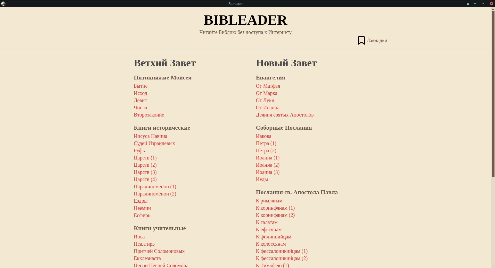

# Bibleader (RU)

Read the Bible without internet access.

Made with [Electron](https://www.electronjs.org/) and [React](https://reactjs.org/).



## Installation

Download and lauch the needed file from the [releases](https://github.com/tiomchik/bibleader/releases) page.

To add this program to the start menu on Linux, you can use [alacarte](https://github.com/GNOME/alacarte).

## Troubleshooting

### The app icon is missing (Linux)

1. Download the [icon](https://github.com/tiomchik/bibleader/tree/main/src/icons/bibleader.png).

2. Copy the icon to the `/usr/share/pixmaps` directory:

```bash
sudo cp bibleader.png /usr/share/pixmaps
```

## Get started (development)

1.  Clone the repository:

```bash
git clone https://github.com/tiomchik/bibleader.git
```

2. Install dependencies:

```bash
yarn
# or
npm install
```

3. Run the app:

```bash
yarn start
# or
npm start
```

## Build

```bash
yarn make
# or
npm run make
```

## Contributing

If you encountered with any bugs or you find any errors in the Bible, please, create an issue.

All pull requests are welcome!

## Links

- [Bible in JSON](https://github.com/rkazakov/usfm2json/tree/master/json)
- Icons ([www.flaticon.com](https://www.flaticon.com), [www.svgrepo.com](https://www.svgrepo.com), [icons8.com](https://icons8.com))

## License

Code is licensed under the [MIT license](https://en.wikipedia.org/wiki/MIT_License).
